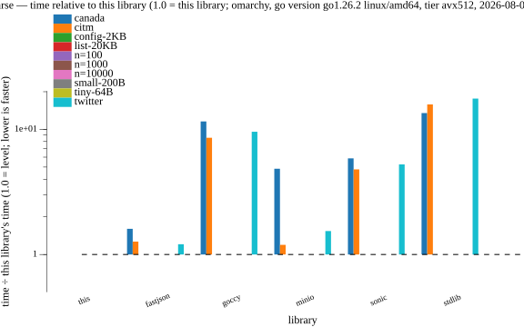
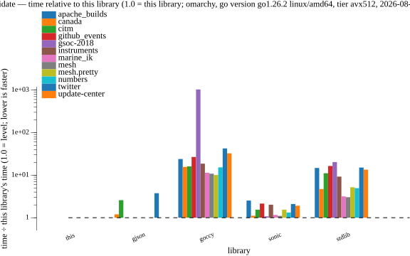
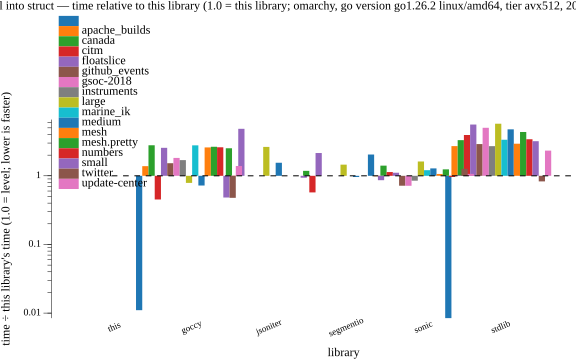
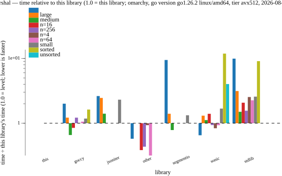
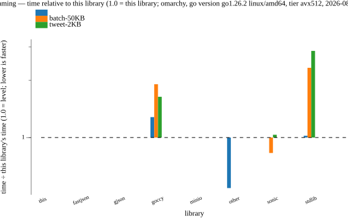
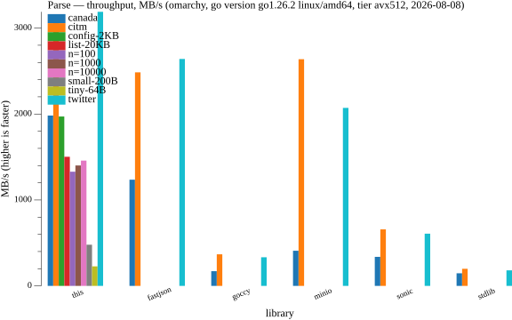
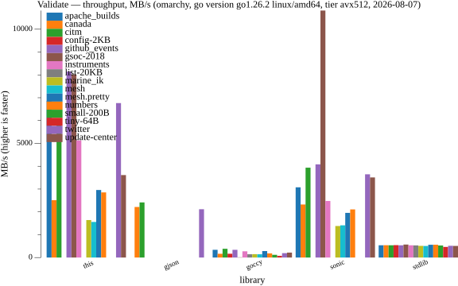
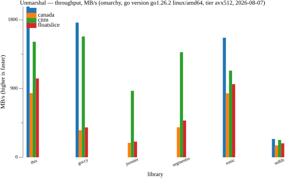
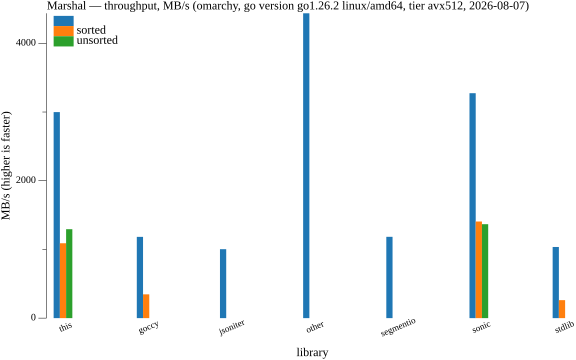
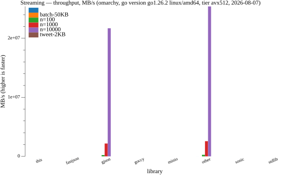

# simdjson

JSON for Go that locates a document's entire structure in a few vector passes
and navigates that index instead of the bytes. Built on
[simd.go](https://github.com/sebishogun/simd).

It provides both a drop-in `encoding/json` surface — `Marshal`, `Unmarshal`,
`Decoder`, `Encoder`, `Valid`, `Compact`, `Indent` — and direct access to the
index, so a field can be read out of a document without decoding the rest of
it.

No cgo. The kernels are generated once from C and shipped as committed
assembly, so the same code runs on amd64, arm64, riscv64, s390x, ppc64le and
loong64.

```
go get github.com/sebishogun/simdjson
```

```go
doc, err := simdjson.Parse(data)
if err != nil {
	return err
}

name := doc.Get("user", "name").String()
age := doc.Get("user", "age").Int()

doc.Get("items").ForEach(func(v simdjson.Value) bool {
	total += v.Key("score").Float()
	return true
})
```

## API

### Parsing and navigation

`Parse` validates the document against JSON's grammar and returns a `Doc`.
`Scan` builds the same index and identifies the root without the grammar
descent. `MustParse` panics instead of returning an error. `Parser` reuses its
index across documents.

From a `Doc`: `Root`, `Get`, `Path`, `Unmarshal`.

A `Value` is a cursor into the index. `Get`, `Key`, `Index` and `Path` move;
`Kind`, `Len` and `Exists` describe; `String`, `StringNoCopy`, `Int`, `Float`,
`Bool`, `IsNull`, `Time` and `Raw` read; `Decode` unmarshals a subtree into a Go
value. Iteration is available as callbacks — `ForEach`, `ForEachKey` — or as
range-over-func: `All`, `Values`, `Keys`, `Members`.

`GetPath` and `GetMany` read one or several dotted paths straight from a byte
slice.

On gjson's own published fixture and rotated paths
(bench/getpath_rows_test.go), the trade is: gjson and jsonparser answer a
one-shot path on the 1.1 KB document in ~145 ns where `GetPath` costs 518 —
they scan forward and stop, this indexes first, and `GetPath`'s documented
promise (a document that does not parse yields Invalid) is what that index
buys. From the SECOND query on the same document, `Parse` + `Doc.Path` runs
each path at 143 ns — level with gjson's every-query price — and on
documents twitter-sized and up the index wins from the first query (83 µs
vs 105, further down). One-shot small-document gets are gjson's; everything
repeated or sizable is ours.

### `encoding/json` drop-in

`Marshal`, `MarshalIndent`, `Unmarshal`, `Valid`, `Compact`, `Indent`,
`HTMLEscape`, `NewDecoder`, `NewEncoder`, `RawMessage`, `Marshaler`,
`Unmarshaler`, and `encoding.TextMarshaler` / `encoding.TextUnmarshaler`.
`Decoder` supports `UseNumber`, `DisallowUnknownFields` and `Token`. The
`omitempty`, `omitzero` and `,string` struct tags are honoured. The error types
are aliases of the standard library's, so existing type assertions continue to
work.

`MarshalTo` appends to a caller-supplied buffer and `MarshalWrite` writes to an
`io.Writer`. `Options` selects encoder behaviour explicitly — `Options.EscapeHTML`,
`Options.SortMapKeys`, `Options.ValidateStrings`, `Options.OmitZeroStructFields`
— and has the same three methods.

### Generated encoders

The struct encoder compiled at run time walks a field table, and that walk
costs about 11% on a real document against straight-line code. For types you
own, `tools/structgen` emits the straight-line code at build time:

```go
//go:generate go run github.com/sebishogun/simdjson/tools/structgen -types User,Status
```

The generated file registers itself via `RegisterEncoder`; `Marshal` then uses
it for that type everywhere it appears — top level, struct fields, slice
elements, map values. Output is byte-identical to the reflect path, which the
generator's own differential asserts. It declines any type it cannot encode
exactly — maps, pointers, interfaces, `[]byte`, embedded fields, tag options,
types with their own `MarshalJSON` — and a declined type keeps the reflect
encoder. Nothing is compiled at run time.

Generated encoders can also be written by hand against the same seam:
`RegisterEncoder`, with `AppendString`, `AppendInt`, `AppendUint`,
`AppendFloat` and `AppendBool` as the primitives, and the same
byte-for-byte contract.

### Editing, streaming and files

`SetPath`, `SetRawPath` and `DeletePath` rewrite a document in place by byte
range, without decoding it. `Skip` returns the extent of the value at the start
of a slice. An edit validates the document and the replacement before it
splices — a Set that produces something unparseable is worse than an error —
and that is the whole difference from sjson, which validates neither: on a
631 KB document, one field edit runs at 1,990 MB/s here against sjson's 4,492
(bench/editing_rows_test.go). The contract costs a validation pass; the
number is what it costs.

`ForEachLine`, `ForEachLineReader` and `ForEachLineReaderParallel` read
newline-delimited JSON.

`OpenFile` maps a file and returns a `MappedFile` with `Bytes`, `Doc` and
`Close`.

## `Parse` or `Scan`

`Parse` checks every value against the grammar and rejects what `encoding/json`
rejects. Use it for input from outside.

`Scan` builds the index and identifies the root, skipping the descent that
proves the parts never read are well-formed. Malformed input then yields wrong
answers rather than errors — nothing reads out of bounds and nothing panics,
but the result carries no guarantee. Use it for bytes you produced.

Validation is the larger part of the cost, which is what makes the distinction
worth having.

`Parser` reuses its index between documents: 318 B per parse against 1,008 KB,
and 286 µs against 345 µs on a 230 KB document.

## Performance

Eight samples per row, shuffled, one process per row, minimum of each, on an
idle amd64 machine; every table below is confirmed by an independent second
pass (worst row-to-row deviation 3.3%). The
`encoding/json` columns are the v1 engine; Go 1.27 intends to make the much
faster jsonv2 engine the default, and `make bench-v2` measures against it —
stdlib struct decode rises to 614–712 MB/s (native v2 API: 759–896), and every
row here still holds, at roughly 2–3× instead of 8×. Every
Competitors run in the
same process on the same bytes; [bench/](bench) is the harness.

**Parsing** — a document in, a navigable and validated structure out:

| | this | fastjson | minio | |
|---|---|---|---|---|
| twitter, 0.63 MB | **198 µs** | 239 µs | 305 µs | **1.21×** |
| citm, 1.73 MB | **548 µs** | 695 µs | 655 µs | **1.20×** |
| canada, 2.25 MB | **1,136 µs** | 1,822 µs | 5,504 µs | **1.60×** |

`Scan` on the same three documents is 50 / 194 / 331 µs. It is a different
operation: it does not validate.

**Validating**, against sonic, the other library doing it with vector
instructions:

| | this | sonic | encoding/json | |
|---|---|---|---|---|
| twitter | **82 µs** | 173 µs | 1,242 µs | **2.10×** |
| citm | **285 µs** | 440 µs | 3,166 µs | **1.54×** |
| canada | **885 µs** | 986 µs | 4,175 µs | **1.11×** |

**Into Go values**, each corpus into its natural struct
(bench/decode_rows_test.go, minimum of three):

| `Unmarshal` → struct | this | goccy | sonic | encoding/json |
|---|---|---|---|---|
| twitter | **311 µs** | 361 µs | 414 µs | 2,562 µs |
| canada | **2.58 ms** | 6.1 ms | 2.64 ms | 14.5 ms |
| citm | 1.12 ms | **0.97 ms** | 1.47 ms | 7.5 ms |
| 2 MB `[]float64` | **2.00 ms** | 5.1 ms | 2.22 ms | 11.2 ms |

The memory column, same rows (`-benchmem`, minimum of two):

| bytes / allocations per op | this | goccy | sonic | encoding/json |
|---|---|---|---|---|
| twitter | **177 KB / 14** | 701 KB / 103 | 753 KB / 182 | 194 KB / 1,410 |
| canada | **1.0 MB / 966** | 4.2 MB / 56,538 | 4.9 MB / 2,588 | 3.1 MB / 3,095 |
| citm | **276 KB / 4,871** | 2.0 MB / 12,565 | 2.2 MB / 15,344 | 373 KB / 6,430 |
| 2 MB `[]float64` | 2.1 MB / **31** | 4.2 MB / 107,555 | 3.6 MB / 62 | 4.1 MB / 31 |

Interned strings, pooled scratch and one-walk numbers add up: fourteen
allocations decode twitter into structs. goccy's citm speed lead costs 7.4×
the memory and 2.6× the allocations; on the `any` tables the same holds —
ours runs every shape at 40–70% of sonic's bytes and a quarter to a half of
its allocations.

canada is level with sonic — 2.5% apart, inside the noise floor — after the
compiled-array, extent-float and one-pass work.

**The field's own fixtures** — the Small/Medium/Large payloads every Go JSON
README descends from (ported verbatim from buger/jsonparser; outputs
byte-agreed with encoding/json before any timing; stdlib-compatible configs
only, which most published tables for these fixtures do not use):

| ns/op, minimum of eight | ours | goccy | segmentio | sonic | jsoniter | stdlib |
|---|---|---|---|---|---|---|
| Unmarshal small (190 B) | 416 | **201** | 359 | 424 | 390 | 1,330 |
| Unmarshal medium (2.2 KB) | 2,055 | **1,484** | 1,974 | 2,635 | 3,185 | 9,771 |
| Unmarshal large (28 KB) | 20,522 | **16,184** | 29,840 | 33,186 | 54,117 | 117,785 |
| Marshal small | **91** | 98 | 112 | 144 | 194 | 212 |
| Marshal medium | 168 | **110** | 126 | 176 | 229 | 245 |
| Marshal large | **1,263** | 1,305 | 1,575 | 1,391 | 2,732 | 3,438 |

goccy's scanner core owns this size class, and
[`wrong.md`](docs/wrong.md) holds the instruction-level decomposition of
why (537 decode instructions per field here against its 680 for
everything). Getting the small decode row from 1,042 ns and 5.2 KB of
garbage per call to 416 ns and 323 B — past sonic — is what this table's
first measurement bought; Marshal small is the generated-encoder row
(`tools/structgen`), now the row's best, and Marshal large is level with
goccy at 3.3%, ours in front. Everything else in the
column beats every library except goccy at every size. citm is goccy's row, cut
from 41% to 22% by the one-walk integer parse (segmentio's 1,388 MB/s now
trails our 1,463): tiny objects of small integers, where a hand-tuned
scanner pays less per token than this design's index amortizes. An index-free prototype measured
4–5× SLOWER on every corpus, and the entry in [`wrong.md`](docs/wrong.md)
has the numbers. jsoniter and segmentio trail everywhere else measured —
191 and 404 MB/s on canada, 213 and 484 on the `[]float64` — and both are
in the harness under stdlib-compatible configurations.

**Out of Go values**:

| | this | sonic | goccy | encoding/json |
|---|---|---|---|---|
| `Marshal`, a struct | 60 µs | **35 µs** | 97 µs | 112 µs |
| `Marshal`, `map[string]struct`, 256 entries | 24 µs | 23 µs | 41 µs | 62 µs |

A decoded document — `map[string]any` with everything under it — encodes
across cores when the output is a quarter megabyte or more: element ranges of
a large `[]any` shard to workers and the results stitch in order, byte-identical
to the serial encode. Re-measured after that change, two passes of five, worse
of the minima:

| `Marshal`, decoded, sorted keys | this | sonic | goccy | encoding/json |
|---|---|---|---|---|
| twitter | **237 µs** | 829 µs | 1,824 µs | 2,217 µs |
| citm | **340 µs** | 1,401 µs | 2,651 µs | 3,294 µs |
| canada | **2,284 µs** | 4,437 µs | 6,976 µs | 7,758 µs |

sonic leads the two struct rows. Both are string escaping: its `quote.c` reserves
worst-case output space and writes escapes inline in one vector pass, where this
package's kernel stops at each byte needing an escape and returns to Go to emit
it. Escaping costs 15.0 µs here on top of a 35.0 µs base; sonic's 27 µs covers
escaping and UTF-8 validation together.

sonic's two passes differed by 19% on the struct row, where every other number
here agreed within 1.6%, so that cell is a range.

Configuration: `sonic.ConfigStd` throughout, which sorts map keys, escapes HTML
and validates strings. `sonic.Marshal` does none of the three; thirty calls on
the same map produce five different outputs. Both are in the harness, the second
marked not comparable.

**Decoded into `any`** — `map[string]any` and `[]any` out of every corpus
shape, MB/s, best of two passes, decodes cross-checked before timing. This
family was sonic's on all twelve shapes until the any path was cured of
per-string and per-key `unquote` and numbers stopped paying an allocation
per box (the float payloads live in a document slab, like decoded strings):

| into `any`, MB/s | ours | sonic | goccy | stdlib |
|---|---|---|---|---|
| twitter | 570 | **683** | 361 | 197 |
| citm | **808** | 712 | 434 | 207 |
| canada | **483** | 371 | 180 | 149 |
| numbers | 520 | 551 | 204 | 164 |
| github_events | 601 | **829** | 455 | 202 |
| apache_builds | 494 | **695** | 428 | 200 |
| gsoc-2018 | 1,424 | **1,989** | 744 | 283 |
| instruments | 453 | **570** | 294 | 175 |
| update-center | 382 | **466** | 264 | 172 |
| mesh | 386 | 362 | 152 | 129 |
| mesh.pretty | **849** | 646 | 301 | 183 |
| marine_ik | **413** | 342 | 157 | 128 |

Bold marks a lead past the 8.3% noise floor; unmarked cells are
statistically level, measured against sonic v1.15.2. The split follows the
data's shape: this package holds the array-heavy corpora — canada 1.30×,
citm, mesh.pretty, marine_ik — where its []any values carve exact-size
from a document-scoped slab; sonic holds six string- and object-heavy
shapes by 18–40%, where its assembled walker feeds map assignment faster
than a compiled Go loop can. Two are level. If decoding into `any` is
your hot path, the shape of your documents decides; measure both. goccy
and stdlib trail throughout.

**Text in, text out**, against `encoding/json`, MB/s:

| | twitter | citm | canada | vs stdlib |
|---|---|---|---|---|
| `Valid` | 7,648 | 6,054 | 2,489 | **4.6–15.2×** |
| `Compact` | 1,588 | 2,154 | 2,164 | **4.2–5.5×** |
| `Indent` | 1,210 | 1,227 | 599 | **2.0–3.3×** |

`Valid` is at or ahead of sonic on all twelve corpus shapes — past the
noise floor on eleven (2.1× on twitter, 2.5× on apache_builds, 1.9–2.2×
across the small-document shapes) and statistically level on the twelfth.
Three kernels carry it: stage one's quote parity by carry-less multiply
(`simd` v1.11.0), the grammar walk fused into one scalar routine over the
stage-one masks (`simd` v1.12.0), and — since `simd` v1.13.0 — the whole
of Valid as a single fused pass, per-block masks that never leave
registers feeding parity, escape validation and the grammar machine with
no mask buffers written or read. That fusion is what closed gsoc-2018,
3.3 MB of escape-heavy strings and the last shape sonic held (1.43×, the
measured price of the staged design): one pass now answers it 32% faster
than the staged pipeline it replaces. A density probe routes
number-dominated documents (canada is 94% number bytes) to the descent
walk instead, which pays nothing per block between one number and the
next; docs/wrong.md holds that measurement, alongside every rejected
step on the way here.

**Under concurrency** — aggregate throughput, every goroutine decoding its
own twitter into its own struct (the many-requests server shape;
bench/parallel_curve_test.go):

| MB/s aggregate | 1 thread | 4 | 16 | 32 |
|---|---|---|---|---|
| ours | **1,950** | **7,494** | **17,661** | **20,041** |
| goccy | 1,694 | 6,104 | 13,365 | 15,762 |
| sonic | 1,387 | 4,976 | 10,562 | 11,952 |
| encoding/json | 208 | 850 | 2,038 | 2,382 |

Fastest at every width, and the flattest curve is sonic's, not ours. This is
the *many documents* axis; the *one document* axis — a single payload sharded
across cores past 8 MB — is the at-scale family above, which no other
library has at all.

**Cold start** — the first operation on a never-seen type, measured by
building a fresh type per iteration (bench/coldstart_test.go), which is what
a deploy's first request meets and what the Pretouch warm-up in published tables hides:

| first contact, ns | ours | encoding/json | goccy | sonic |
|---|---|---|---|---|
| Unmarshal, 5-field struct | **3,205** | 3,546 | 4,629 | 857,495 |

sonic's 268× is its JIT compiling the fresh type — the cost Pretouch
warm-ups hide; ours is a table build, and structgen'd types pay nothing at
all.

**Streaming**, 50,000 newline-delimited records, 6.5 MB:

| | this | goccy | sonic | encoding/json |
|---|---|---|---|---|
| `Decoder` | **9.7 ms** | 11.9 ms | 13.7 ms | 37.8 ms |
| `Encoder` | **5.9 ms** | 6.9 ms | 9.1 ms | 9.6 ms |

Allocation for the same input is 9.5 MB in 150,183 allocations, against goccy's
12.9 MB in 306,525.

Record size is the axis that decides it. Streams of two-kilobyte records --
real tweets, newline-delimited, decoded into `any` -- run 515 MB/s here
against sonic's 505; at fifty-kilobyte records the per-value work is almost
entirely the any-decode itself and sonic's assembled walker takes it, 505
against 445. The crossover is the same residual the any-decode table above
prices, reached through a different door.

**Small documents** are the size where an index does not pay. It costs the same
few passes whether the document is 64 bytes or a megabyte:

| | this | fastjson | encoding/json |
|---|---|---|---|
| 64 B | 123 ns | 40 ns | 76 ns |
| 200 B | 276 ns | 103 ns | 233 ns |
| 2 KB | **890 ns** | 1,080 ns | 3,437 ns |
| 20 KB | **7,951 ns** | 10,882 ns | 24,271 ns |

The crossover is between 200 bytes and 2 KB. Below it, `encoding/json` is the
better choice.

**Pulling one field out of a document.** 10,000 items, 1.17 MB, one field read.
Everything here validates the whole document:

| | 10,000 items | |
|---|---|---|
| **this — `Parse`** | **0.802 ms** | |
| [valyala/fastjson](https://github.com/valyala/fastjson) | 1.307 ms | 1.63× |
| [minio/simdjson-go](https://github.com/minio/simdjson-go) | 2.054 ms | 2.56× |
| [bytedance/sonic](https://github.com/bytedance/sonic) | 5.344 ms | 6.66× |
| [goccy/go-json](https://github.com/goccy/go-json) | 8.794 ms | 10.97× |
| `encoding/json` | 9.764 ms | 12.2× |

fastjson led this table by 9% when it was first measured; the kernel work
since put `Parse` 1.63× ahead. fastjson builds a value tree into a reusable
arena rather than an index, so navigation afterwards is a pointer walk where
this is a lookup into a position array.

**Against lazy scanners.** [gjson](https://github.com/tidwall/gjson) and
[jsonparser](https://github.com/buger/jsonparser) scan for a path and stop at
the first match rather than parsing the document. `gjson.Get` is not the same
operation as `Parse`: it does not validate, and answers from input that is not
JSON.

| input | `gjson.Get` returns | valid JSON |
|---|---|---|
| `{"a" 1}` — no colon | `"1"` | no |
| `{"a":1` — unterminated | `"1"` | no |
| `{"a":01}` — invalid number | `"01"` | no |

With validation on both sides, on a 10,000-item document:

| | gjson | this | |
|---|---|---|---|
| both validating — `gjson.Valid`+`Get` against `Parse`+`Get` | 739 µs | 802 µs | gjson 1.08× — level |
| neither validating — `gjson.Get` against `Scan`+`Get` | 0.1 µs | 169 µs | gjson ~1,700× |

For one field, stop-at-first-match wins by construction when nothing is
validated, and validation brings the two level. Two comparisons where the
operations do match:

| reading the whole document once | time | result |
|---|---|---|
| `gjson.Valid` | 732 µs | a `bool` |
| **`Scan`** | **173 µs** | a reusable index — **4.2×** |
| `Parse` | 809 µs | that index, and the grammar proved |

gjson retains nothing, so each `Get` rescans from byte zero, while this indexes
once. Reading `items.N.score` for N across a 10,000-item document:

| queries | gjson | this | |
|---|---|---|---|
| 1 | 0.1 µs | 169 µs | gjson ~1,700× |
| 10 | 3.1 µs | 170 µs | gjson 55× |
| 100 | 220 µs | **205 µs** | **1.07× — level** |
| 1,000 | 20.2 ms | **3.1 ms** | **6.4×** |

The crossover is about a hundred queries per document. Both are quadratic —
gjson rescans to reach element N, `Index(j)` walks j elements — but each step
here is a lookup rather than a byte scan.

gjson offers a path language this does not: wildcards, `#(age>45)` filters,
about fifteen modifiers, JSON Lines and custom modifiers. This has `Get`, `Key`,
`Index`, `Path` and `ForEach`. Its own documentation states that the `Get*`
functions "expect that the json is well-formed" and that bad JSON "may return
back unexpected results", which is what the validating row above measures.

**Choosing.** gjson or jsonparser for pulling a field or two from a document
you produced. This package when the document comes from outside and must be
checked, when it will be queried more than a few hundred times, or when the
target is not amd64.

### At a gigabyte and beyond

Real documents repeated to size, with a deliberate best and worst case:

| 1 GB, one piece | `Scan` | `Valid` | `Parse` | `encoding/json.Valid` |
|---|---|---|---|---|
| best case: minified ASCII, long values | 7,302 MB/s | 5,859 | 5,143 | 583 |
| worst case: nothing but brackets and escapes | 1,166 | 1,497 | 707 | 471 |

Six times between the two for `Scan`. A single throughput number for a JSON
parser is an average over shapes that differ by that much.

Those rows are single-threaded. From 8 MB up, `Scan` and `Parse` build the
structural index across cores — segments are indexed in parallel and the
bracket pairs that cross a segment are merged serially, with output
bit-identical to the single-threaded path, errors included. 64 MB of
numbers-heavy JSON scans at 31.1 GB/s on 32 cores against 5.1 single-threaded;
BenchmarkParallelScan reproduces it. When the root is
an array of containers — the shape huge documents have — the bracket index
gives every element's exact extent, and the grammar walks themselves shard
across workers, ranges balanced by bytes rather than element count so
twenty-eight two-megabyte documents split as well as three million records.
At 64 MB: `Valid` 2.2 → 12.2 GB/s, `Parse` 1.8 → 11.5 GB/s, and `Unmarshal`
into a struct slice 1.95 → 15.3 GB/s — each held identical to its serial path
by a differential, errors included; other shapes walk serially over the same
index. `Compact` and `Indent`
join them — validation through the same parallel walk, and each transform
sharded two-phase off the masks with its two-value writer state (depth and the
pending-newline flag) carried across segment folds — at 0.5 → 2.5 GB/s and
0.27 → 1.23 GB/s respectively on 60 MB documents.

Past 2 GiB, `Parse` and `Scan` return an error naming the alternative — see
[Limits](#limits). That alternative is `Decoder`, which has no size limit. Ten
gigabytes of tweets, 2.93 M records of about 3.4 KB each, from
`cd bench && go test -run TestHuge -huge -huge-bytes 10000000000 .` — better
of two passes, worse of the two heap peaks:

| 10 GB | decoded into | time | throughput | peak heap |
|---|---|---|---|---|
| line-delimited | `Value` | 3.46 s | **2,892 MB/s** | 8.0 MB |
| line-delimited | struct, 4 fields | 5.03 s | 1,988 | 9.4 MB |
| line-delimited | `map[string]any` | 30.03 s | 333 | 9.3 MB |
| one array | `Value` | 3.66 s | 2,731 | 8.5 MB |
| one array | struct, 4 fields | 5.04 s | 1,985 | 8.9 MB |
| one array | `map[string]any` | 29.82 s | 335 | 9.2 MB |
| one array, 300 M small elements | struct, 3 fields | 22.65 s | 441 | 9.3 MB |

Under ten megabytes of heap for ten gigabytes of input, because nothing is
held whole.

The decode target sets the throughput more than the parser does. `Value` builds
no Go value and is the parser's own rate; `map[string]any` allocates a map and
an interface per field and is 8× slower on identical bytes. Each row names its
target for that reason.

Whole-document `Unmarshal` of a root array eight megabytes and up decodes
across cores: element extents come from the parallel index, workers decode
straight into the result slice, and any anomaly falls back to the serial
decode, which owns the error. 32 MB of tweets into structs runs at 15.3 GB/s
against 1.95 single-threaded — 7.9×, minimum of three — with values and errors
identical to the serial path by differential.

A single enormous array works as well as line-delimited records. Read the
opening bracket with `Token`, then `More` and `Decode`, as with the standard
library:

```go
dec := simdjson.NewDecoder(r)
if _, err := dec.Token(); err != nil { // the opening [
	return err
}
for dec.More() {
	var rec Record
	if err := dec.Decode(&rec); err != nil {
		return err
	}
	process(rec)
}
```

An object works the same way, with `Token` for each key and `Decode` for the
value after it.

### Nine shapes

twitter, citm and canada cover strings-and-objects, objects-and-whitespace and
numbers. `shapes_test.go` adds deep nesting, wide objects, long strings,
escape-heavy strings, non-ASCII, bare numbers, bare literals, pretty-printed and
empty containers — each about a megabyte, each checked against `encoding/json`
through every entry point before it is timed. `Scan` holds 12.3–12.5 GB/s on all
of them except the two that are nothing but brackets.

### The shape of it

Every row in the tables above, drawn. Ratio is time ÷ this library's time on
the same bytes; the dashed line is 1.0, so bars below it are rows another
library wins — and they are all here, because a chart that only shows the
winning side is a sales pitch. The throughput charts carry the same rows in
MB/s. All figures are regenerable and honest by construction: the snapshot
they are drawn from ([`docs/bench/`](docs/bench)) names the machine, the
instruction-set tier, the Go version and the date, and `make bench-all`
re-measures and re-renders.











Raw throughput, for the record:











**How these were measured.** Every benchmark runs in its own fresh process —
no benchmark's warm cache, branch history or allocator state carries into the
next — and the order is shuffled per run. Each number is the minimum of eight
samples, the estimator this repository's gate uses (layout noise is one-sided;
the minimum converges to the true code speed). The machine is quiet, the tier
is the one named in the snapshot (`simd.Tier()`), and the rivals run in the
same process family on the same bytes. Slow rows — a benchmark whose single
iteration exceeds the discovery threshold — are skipped and listed in the
snapshot rather than run for hours; `-include-slow` restores them. The full
record is `make bench-all`; the raw gate numbers are in
[`testdata/bench/`](testdata/bench).

## Limits

**Document size.** `Parse` and `Scan` index a document in one piece and cap at
2 GiB, because a bracket position is an `int32` and the index is already 0.93×
the size of the document; `int64` positions would take it past 1.4× and charge
every ordinary parse for a size that has a better answer. Above the cap they
return an error naming `Decoder`, which streams in 64 KiB buffers and has no
limit.

**Whole-document decoding.** Reading an entire document into Go values is
slower than the standard library's single fused decode. An index pays for
reaching *into* a document, not for reading all of it.

**Strings with escapes are not zero-copy.** A string containing no backslash is
returned without copying out of the document; one with an escape is decoded into
a new string.

**Small inputs.** Below roughly a kilobyte the fixed cost of the index is the
whole cost. See the table above.

## Correctness

Correctness is defined as agreeing with `encoding/json` and tested that way:
hand-written cases, 2,000 randomised documents built from atoms chosen to
collide (structure inside strings, escaped quotes, escaped backslashes,
surrogate pairs), and differential fuzzing.

Eight fuzz targets compare against the standard library — parse, unmarshal,
marshal, text operations, `Decoder`, `Token`, streamed array elements and UTF-8
validation — and demand the same bytes and the same error-or-not, not merely
the same meaning.

```
go test ./...
go test -run '^$' -fuzz FuzzAgainstStdlib -fuzztime 60s
make verify        # fmt, vet, tests, race, every instruction tier, purego
make fuzz          # every differential target
```

The suite runs against each instruction tier separately (`scalar`, `sse2`,
`avx2`, `avx512`) and under `-tags purego`, so every dispatch path is covered
rather than only the one the build machine selects.

Findings that shaped the implementation, including measurements that argued
against changes that were then reverted, are recorded in
[docs/wrong.md](docs/wrong.md).

## How it works

Two stages, the design C++ simdjson introduced.

**Stage one** classifies the document with vector compares and answers
everything that follows with bit arithmetic. Three passes produce a bitmask each
— one bit per input byte — for the quotes, the backslashes and the six
structural characters. A conventional parser reads a byte and branches on what
it is, which is a dependent, unpredictable branch per byte. This has no per-byte
branch at all.

**Stage two** walks the surviving positions. A megabyte document might hold
fifty thousand structural characters, so the second stage sees fifty thousand
items rather than a million bytes.

The difficulty is in stage one. A `{` inside a string is text, and a `"`
preceded by an odd number of backslashes closes nothing — in `"a\\"` the quote
follows two backslashes and does close the string, while in `"a\"` it follows
one and does not. Both are resolved before any position is interpreted, as
arithmetic over sixty-four bytes at a time:

- **which quotes are escaped** — adding the odd-length backslash-run starts back
  into the backslash mask propagates a carry through each run and lands it one
  past the run's end, turning "the parity of this run" into a single add;
- **which bytes are inside a string** — an inclusive prefix XOR of the surviving
  quote mask, six shift-and-xor steps per word, with the parity carried into the
  next word by sign-extending its top bit;
- **which structural characters survive** — an and-not.

None of it costs anything per match.

Streaming indexes per buffer rather than per value, in **partial mode**, which
treats a value cut in half by the end of the buffer as a fact to report rather
than an error: it indexes what is there and records how far that reaches. Array
elements are batched by bytes rather than by count — an element of a megabyte
fills a batch alone, a hundred-byte record shares one with six hundred others —
and the batch boundary is read off the index rather than found by a separate
scan. A sustained `Value` loop over records goes further: batches are capped
so the buffer holds the next one, a background task prepares it — index,
scan, and validation fanned across cores — while the current one drains, and
delivery hands each record out from its staged extent alone, with no
whitespace skip, bracket match or validate left on the mainline. 1,450 →
1,974 MB/s on 64 MB of newline-delimited records. `Decode` keeps its serial
per-value walk deliberately: decoding element k starts from the caller's
variable as element k−1 left it, so the results chain by contract.

## When to use it, and when not to

Every claim below cites a table in this README or a file in this repository;
none of it is asserted from goodwill.

**Use this library when:**

- **Documents are a megabyte or more.** Fastest Go parse and validate on
  every corpus measured (Performance tables above), and past 8 MB fastest,
  period — the parallel family has no counterpart in Go or C++
  ([`docs/cpp-baseline.md`](docs/cpp-baseline.md)).
- **You serve many requests.** Fastest aggregate decode at every thread
  count, 20 GB/s at 32 threads, with the flattest competitor curve being
  sonic's, not ours (concurrency table).
- **Streams: NDJSON, logs, exports.** The streaming tables, the 10 GB rows
  under ten megabytes of heap, and a `Value` loop that pipelines its batches
  across cores.
- **Numbers dominate.** canada-class struct decode level with sonic, plain
  `[]float64` ahead of it, the numbers corpus ahead — the one-walk
  integer/float parsers and slab boxing did this.
- **You query one document more than once.** The second dotted-path query
  costs what gjson pays for every query; from twitter-size up the index wins
  from the first (GetPath notes above).
- **You decode into `any`.** Four leads, five levels, three floor-adjacent
  across twelve shapes (the `any` table).
- **Deploy posture matters.** No cgo, no JIT, no runtime executable memory,
  same code on six architectures, the fastest cold start in the field
  (first-contact row — sonic pays 2.5× compiling), and the conformance
  suites (JSONTestSuite, jsonchecker, UTF-8 stress) run in the ordinary
  test pass with zero disagreements against encoding/json.
- **You own your types and want the last drop.** `tools/structgen` emits
  compile-time encoders: level with goccy on the field's small Marshal
  fixture, byte-identical output enforced.

**Prefer something else when:**

- **Tiny one-shot parses dominate.** Sub-2 KB single documents: goccy's
  scanner core leads decode (176 ns vs our 404 on the field's small
  fixture), stdlib is fine, and Go 1.27's jsonv2 narrows every library's
  margin there for free.
- **Small-struct Marshal is the hot path.** sonic's fused JIT writer holds
  ~2× (the decomposition in [`wrong.md`](docs/wrong.md) says exactly why,
  and what it would cost to chase) — if its posture fits your deploy.
- **Dense tiny-object decode.** citm-class shapes: goccy leads by ~1.2×
  (same scanner-core wall, measured three ways).
- **One-shot field-gets on small documents.** gjson answers in 145 ns where
  we pay 518 for the index and the validity promise; the trade flips on
  size or repetition (GetPath notes).
- **Indented output is the product.** MarshalIndent trails goccy's fused
  indent encoder by 1.24×.

**Known costs, stated:** the index is real memory (roughly document-sized;
`Parser` reuse amortizes it); performance numbers are measured on amd64 —
the other five architectures run the same code and the same tests, but the
tables are from one machine; and published comparisons elsewhere often use
lossy configurations (unsorted keys, skipped validation, warmed JITs) that
this harness deliberately refuses, so our numbers for competitors run lower
than their READMEs and are the defensible ones.

## Status

Feature-complete against `encoding/json`: the drop-in surface passes the
stdlib's own decode, encode, stream and tag test files, vendored and run in
CI, and every entry point is differentially fuzzed against it. Wall-clock
numbers are measured on amd64 (tier and machine named in each snapshot);
the `simd` package underneath is correctness-verified on six architectures
under emulation and wall-clock-verified on amd64 and arm64 NEON.

## The rest of the family

All built on [simd.go](https://github.com/sebishogun/simd), which generates its
kernels once from C and ships them as committed assembly for nine instruction
sets — so none needs cgo, and none is amd64-only.

| | |
|---|---|
| [**simd.go**](https://github.com/sebishogun/simd) | 474 vector operations over slices, bytes and text. The kernels everything else is built from. |
| [**simdblas**](https://github.com/sebishogun/simdblas) | A BLAS backend for gonum. One `blas64.Use` call and `mat`, `stat` and `optimize` run on it. |
| [**simdcsv**](https://github.com/sebishogun/simdcsv) | CSV reading on one vector scan per record. |
| [**simdvec**](https://github.com/sebishogun/simdvec) | Embedding search whose whole index scan is one matrix-vector product. |

## License

MIT — see [LICENSE](LICENSE). Depends on
[simd.go](https://github.com/sebishogun/simd) (MIT).
